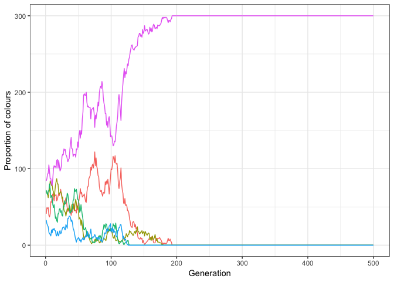

Overview
--------

This is a work in progress investigating some of the ideas and concepts in the book, Games of Life by Karl Sigmund. The idea is to get a visual impression of some of the basic and fundamental processes in evolutionary biology. Usually, the function (like `random_drifts()`) will output a ggplot object at the end, from which you can extract all of the simulation data or fiddle with the plot to make it prettier.

Installation
------------

``` r
# Install this development version from GitHub: (I don't think it will ever go on CRAN)
# install.packages("devtools")
devtools::install_github("Euphrasiologist/GOL")
```

Dependencies
------------

So far, the only dependencies are data.table and ggplot2. Install them as follows:

``` r
install.packages("data.table"); install.packages("ggplot2")
library(data.table); library(ggplot2)
```

Usage
-----

I hope that it's all very easy to work. Adjust the parameters in the function and you're away!

``` r

random_drifts(colours = 5, trials = 500, size = 300)
#> Loading required package: data.table
#> Loading required package: ggplot2
#> Warning: package 'ggplot2' was built under R version 3.5.2
```



Improvements
------------

Hopefully at some point I will write a litte document explaining the functions and why they are interesting, but I will wait until there is a critical mass of sufficiently good functions before I do so!
